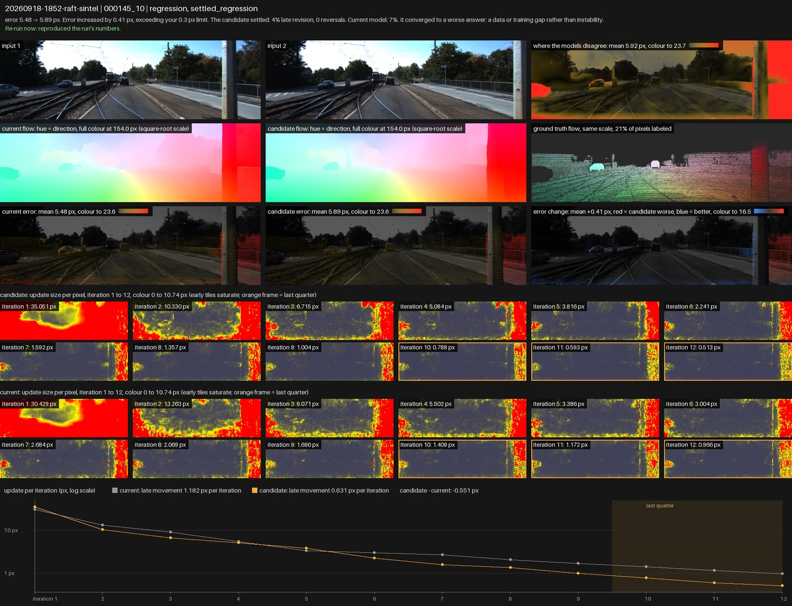

# Rabbit Brain

> **Status.** `pip install rabbit-brain` gives you 0.1.1: import results, rank, save checks, receipts. The runner (`rb init`, `rb doctor`, `rb verify-hook`, `rb run` with the RAFT adapter) is on `main` as 0.2.0.dev and ships as 0.2.0; install from source (`pip install -e ".[raft]"`) to use it now.

Release review for iterative perception models. Give it the per-case errors of your current and candidate checkpoints (and, if the model refines its answer iteratively, one number per refinement iteration) and it ranks the cases to look at: the ones that regressed on error, and the ones that pass on error but never settled. Then it keeps checks for the next checkpoint.

```sh
pip install "rabbit-brain[raft]"
rb init --project my-flow --adapter raft --model-code ./raft --dataset ./data/kitti2015/training
rb doctor && rb verify-hook --checkpoint ckpt/raft-things.pth
rb run --baseline ckpt/raft-things.pth --candidate ckpt/raft-small.pth    # both checkpoints, trajectories recorded for you
rb findings <run> --top 5     # the ranked queue and a verdict
rb check save <run> <case>    # keep a case for the next checkpoint
rb check run <run>            # exit 1 in CI when something regressed

rb import results.json        # or bring per-case results your evaluator already produced (rb schema example)
rb init --demo && rb run --baseline ckpt/synth-current.json --candidate ckpt/synth-candidate.json   # a synthetic dry run on any machine
```

Everything runs locally and nothing leaves your machine. Every run leaves a receipt (`report.md`, `record.json`) with the exact command, the input's hash and the definitions in force, so a colleague, or you after your coding agent ran it, can verify the numbers.

**What it does.** Compares two model versions case by case; flags regressions above a limit you choose; reads each model's own refinement trajectory (label-free) and flags cases where the candidate was still moving its answer more than the current model did, which is the same regression test for cases you have no ground truth for; ranks what needs a decision first; explains each case in plain language; saves checks that follow case ids across checkpoints.

**What it needs.** Either a checkpoint pair and a case set for a supported adapter (RAFT-family optical flow today; other models through a small custom adapter), or one lower-is-better error per case for both models from your own evaluator (any metric with a unit: endpoint error in px, depth error in cm, …), computed against the same ground truth and valid mask. Trajectories are recorded by the adapter with a forward hook, or by the one-line `TrajectoryRecorder` in your loop.

**What it doesn't do.** Train anything, or certify a model. The stability limits are generic heuristics; a scorer fitted to your model is a separate, paid evaluation. For the cases it flags it renders the evidence (inputs, where the two models disagree, both flow fields, error maps and the change in error, the per-iteration filmstrips) so the decision is a look, not a number.

**What a flagged case looks like.** The one regression in a real review of raft-sintel against raft-things on KITTI-2015 ([examples/raft-kitti](examples/raft-kitti)): +0.41 px on this case, and the sheet shows it is one object, the pole nearest the camera, which both checkpoints keep moving through all twelve iterations.



**For coding agents.** `rb docs` prints [AGENTS.md](AGENTS.md): the workflow, the file format, the JSON output (`--json` on every command), exit codes and every error code with its fix. Tell your agent: *"Review candidate checkpoint B against A on this case set with Rabbit Brain."*

The trajectory diagnostic comes from a paper that is not public yet; the reference goes here when it is.

Apache-2.0.
